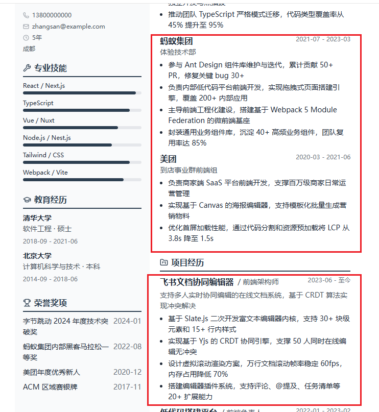
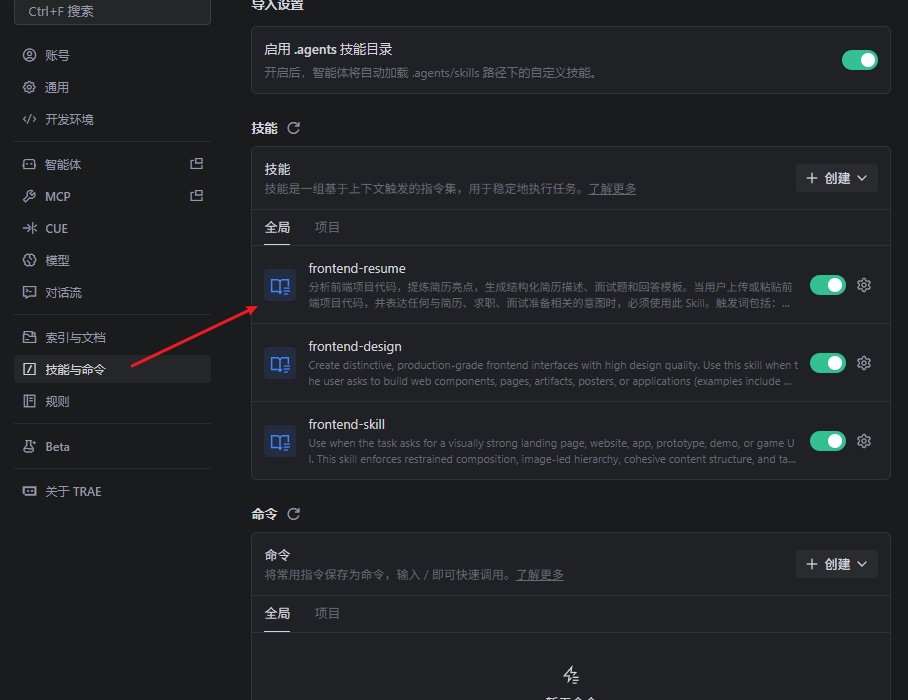
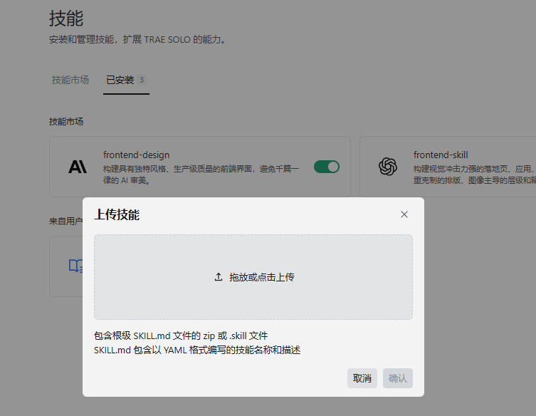
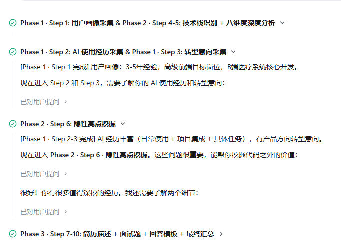
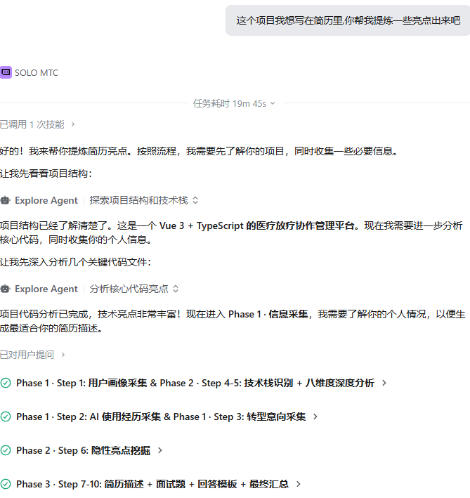

# 前端简历提炼 Skill —— 让代码自己说话

---

## 1、Skill 简介

**frontend-resume** 是一个专门用于分析前端项目代码、提炼简历亮点、生成结构化简历描述和面试准备的 Skill。

**核心能力**：上传代码片段（推荐 3-5 个）→ AI 自动分析技术栈 → 挖掘隐性亮点 → 输出简历描述 + 面试题 + 回答模板

> 💡 也可以上传整个项目或粘贴代码链接，但提供核心代码片段分析效果更精准。

**一句话说明**：帮助前端开发者把"每天写的代码"变成"面试官想听的简历亮点"。

**适合人群**：正在求职或准备跳槽的前端工程师（1-5 年经验）

---

## 2、使用场景

### 为什么想做它？

写简历的时候，你是不是也有这种感觉——

基本信息、教育经历、专业技能这些都能很快填完，但到了**「工作经历」**和**「项目经历」**这两栏，光标一闪一闪，半天敲不出几个字：

> "这个项目做了大半年，到底该写啥？"
> "我每天写的代码好像都很普通，没什么亮点啊……"
> "别人简历上写的那些高大上的描述，我咋写不出来？"



**工作经历**和**项目经历**几乎是每个前端写简历时最头疼的部分。技术栈大家都知道，但怎么把每天做的业务、写的代码变成面试官想看的内容？这就是我做这个 Skill 的初衷。

### 做出来之后能省掉哪些动作？

| 原来需要 | 现在只需 |
|---------|---------|
| 自己翻代码找亮点 | 上传代码，AI 自动识别 |
| 苦思冥想怎么写简历 | 直接复制 AI 生成的描述 |
| 到处搜面试题 | 针对你的代码自动生成 |
| 自己组织回答思路 | 提供结构化回答模板 |

**预计节省 2-3 小时的简历准备时间**

---

## 3、创作过程

### 核心思路

这个 Skill 的设计基于一个观察：**亮点不等于"难"**。很多开发者觉得自己写的代码"没什么好说的"，但对面试官来说可能是加分项。

所以我设计了三阶段工作流：

```
Phase 1 · 信息采集（用户画像 + AI 经历 + 转型意向）
Phase 2 · 代码分析（技术栈 + 八维度 + 隐性亮点挖掘）
Phase 3 · 输出生成（简历描述 + 面试题 + 回答模板）
```

### 关键设计决策

**1. 必填式信息采集**

不让用户跳过任何关键信息，用直接提问代替选项：

```
❌ 不好的问法："你的项目类型是？A. B端 B. C端 C. 内部工具"
✅ 好的问法："你的项目是面向 B 端客户、C 端用户、内部工具，还是开放平台？"
```

**2. 隐性亮点六维挖掘**

把用户容易忽略的价值点分类，引导用户回忆：

| 类别 | 用户心声 | 实际价值 |
|------|---------|---------|
| A 类 | 「我只是封装了一下」 | 抽象能力 |
| B 类 | 「这是产品要求的」 | 需求转化能力 |
| C 类 | 「大家都这么做」 | 工程意识 |
| D 类 | 「踩过坑才做的」 | 问题解决能力 |
| E 类 | 「只是提了个建议」 | 团队贡献 |
| F 类 | 「产品说要能自己改」 | 动态配置能力 |

**3. 优先级简历描述**

根据亮点价值分级输出，避免信息过载：

| 优先级 | 标识 | 说明 |
|--------|------|------|
| P0 | 🔴 必写 | 体现架构能力、解决复杂问题 |
| P1 | 🟡 建议写 | 体现工程化思维、技术深度 |
| P2 | 🟢 可选 | 常规技术实现 |

**4. 结构化面试题四层设计**

| 层级 | 问题类型 | 考察点 |
|------|----------|-------|
| 第一层 | 原理理解 | 技术基础是否扎实 |
| 第二层 | 方案设计 | 是否有技术判断力 |
| 第三层 | 问题排查 | 实战问题解决能力 |
| 第四层 | 行为面试 | 团队协作与沟通能力 |

---

## 4、使用步骤

### 4.1 引用方式

#### 方式一：IDE 内置配置

如果你使用的是支持 Skill 功能的 IDE（如 Cursor、VS Code + SOLO 插件等）：

1. 打开 IDE 的 Skill 配置面板
2. 点击"添加 Skill"或"导入 Skill"
3. 选择或粘贴 `frontend-resume_SKILL.md` 文件内容
4. 保存配置



#### 方式二：App 里引入

如果你使用的是 SOLO App：

1. 打开 SOLO App
2. 进入 Skill 市场或搜索页面
3. 搜索 "frontend-resume" 或 "前端简历提炼"
4. 点击"添加"或"启用"



---

### 4.2 触发方式

在输入框中输入以下任意关键词即可触发：

```
简历、Resume、CV、面试、求职、亮点提炼、项目描述、代码分析、前端项目、技术总结
```

**或者直接说话**：

```
"帮我看看这段代码能写什么简历"
"这个项目怎么写在简历上"
"帮我分析一下我的前端项目"
"我最近在找工作，帮我准备面试"
```

---

### 4.3 操作步骤

只需要三步，就能拿到完整的简历描述 + 面试题 + 回答模板：

#### 第一步：上传你的代码

**推荐上传 3-5 个核心代码片段**，比如：
- 请求封装、状态管理、权限控制等工具函数
- 复杂业务组件
- 构建/路由配置文件

> 不需要是"厉害"的代码，普通的也行，重点是你做了什么、解决了什么问题。

直接丢给 AI，说一句：
> "这个项目我想写在简历里，帮我提炼一些亮点"

#### 第二步：回答引导问题

AI 会分阶段引导你完成信息采集，界面长这样(亲爱的宝子,不要觉得烦,你分享的越详细,AI 会越准确)：



**阶段一 · 用户画像**
- 项目类型、你的角色、工作年限、目标岗位
- AI 使用经历、转型意向

**阶段二 · 隐性亮点挖掘**
- 封装与复用、复杂交互实现、工程化实践
- 踩坑与解决、团队贡献、动态配置能力

> 💡 这些问题能帮你挖掘代码之外的价值，比如"踩过什么坑"、"推动了什么改进"

#### 第三步：获取完整输出

整个流程跑完，你会得到：

| 输出物 | 说明 |
|--------|------|
| 📝 简历描述 | 按 P0/P1/P2 优先级排列，可直接复制 |
| ❓ 面试题 | 按亮点分组，覆盖原理→设计→排查→行为 |
| 💡 回答模板 | 结构化的答题思路，结论先行 |

**实际效果长这样：**



**预计耗时 8-15 分钟**，比你自己琢磨快多了 👍

---

## 5、效果展示

### 5.1 输入示例

```
我工作 2 年，做了一个 B 端后台管理系统，用 Vue3 + TypeScript。
这是我的请求封装代码：[粘贴代码]
```

### 5.2 简历描述输出示例

```
🔴 请求层统一封装 · 来源：八维度 5.2
简历描述：设计并实现基于 axios 的请求封装层，统一处理 token 刷新、
错误拦截和 loading 状态，支持请求取消和并发控制，被团队 5 个项目复用，
新页面接入成本从 30 分钟降至 5 分钟。

🟡 工程化规范落地 · 来源：隐性亮点 C 类
简历描述：推动团队引入 ESLint + Prettier + Husky 代码规范，配置 pre-commit
钩子自动格式化，代码风格统一度提升，新成员上手时间缩短 50%。
```

### 5.3 面试题示例

```
【第一层 · 原理理解】
"能解释一下 axios 拦截器的执行顺序吗？请求拦截器和响应拦截器分别在什么时机执行？"

【第二层 · 方案设计】
"如果让你从零设计一个请求封装层，你会考虑哪些功能？"

【第三层 · 问题排查】
"token 刷新时如果同时有多个请求，怎么避免重复刷新？"

【第四层 · 行为面试】
"在推动代码规范时，有没有遇到团队成员的抵触？你怎么处理的？"
```

### 5.4 回答模板示例

```
【结论先行】
通过 axios 拦截器实现了统一的 token 管理和错误处理。

【技术原理/方案选型】
- 请求拦截器：在请求发送前统一添加 token
- 响应拦截器：处理 401 状态码，自动刷新 token 并重试原请求
- 用 pendingQueue 缓存请求，避免 token 刷新期间的重复刷新

【项目中的实际应用】
场景：后台管理系统，需要统一处理登录态过期和接口错误
挑战：token 刷新期间多个请求同时触发，导致多次刷新
解法：用队列管理并发请求，刷新完成后再统一重试

【结果与收益】
- 所有页面无需单独处理 token 和错误
- 接口错误处理代码量减少 80%
- 被团队其他项目直接复用

【延伸/反思】
若重来，会考虑用响应拦截器统一处理错误提示，减少代码重复
```

### 5.5 效果对比

| 维度 | 使用前 | 使用后 |
|------|--------|--------|
| 找亮点 | 自己翻代码，靠感觉 | AI 自动识别，结构化输出 |
| 写简历 | 苦思冥想，不知道怎么写 | 直接复制 AI 生成的描述 |
| 准备面试 | 到处搜题，没有针对性 | 针对你的代码自动生成 |
| 回答问题 | 临场发挥，容易紧张 | 有结构化模板，心里有底 |

---

## 6、Skill 链接

**GitHub 仓库**：
```
https://github.com/your-username/frontend-resume-skill
```

**完整 Skill 文件**：
```
https://github.com/your-username/frontend-resume-skill/blob/main/frontend-resume_SKILL.md
```

**使用文档**：
```
https://github.com/your-username/frontend-resume-skill/blob/main/README.md
```

## 7、总结与思考

### 最满意的地方

1. **"隐性亮点"概念**：帮助用户发现自己忽略的价值，解决"不知道写什么"的痛点
2. **结构化输出**：不只是给结果，而是给完整的求职准备方案（简历+面试+回答）
3. **必填式设计**：通过引导式提问确保信息采集完整，避免输出质量不稳定

### 后续优化方向

1. **支持更多框架**：目前主要针对 前端,后续扩展后端简历提取
2. **量化数据建议**：根据项目类型自动推荐可量化的指标
3. **简历模板导出**：直接生成 Markdown/Word 格式的简历文件
4. **面试模拟模式**：增加模拟面试对话功能，让用户练习回答

### 希望得到的建议

1. 你是否遇到过"不知道简历写什么"的困扰？这个 Skill 能解决吗？
2. 对于隐性亮点的六类分类，是否有遗漏的重要类型？
3. 面试题的四层结构是否覆盖了你的面试经历？

---

**相关项目推荐**：

| 项目 | 说明 |
|------|------|
| [vite-plugin-resume](https://github.com/example/vite-plugin-resume) | 简历生成插件 |
| [react-resume-builder](https://github.com/example/react-resume-builder) | React 简历构建器 |

---

*本 Skill 使用 SOLO 平台创建，感谢 SOLO 提供强大的 AI 能力支持。*
